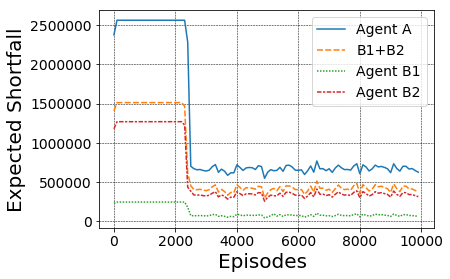
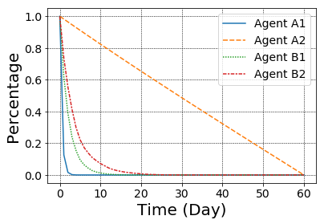
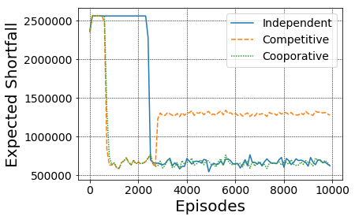
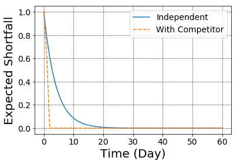

# Multi-Agent Reinforcement Learning for Liquidation Strategy Analysis
Source code for paper:Multi-agent reinforcement learning for liquidation strategy analysis accepted by ICML 2019 AI in Finance: Applications and Infrastructure for Multi-Agent Learning.

## Abstract

Liquidation is the process of selling a large number of shares of one stock sequentially within a given time frame, taking into consideration the costs arising from market impact and a trader's risk aversion. The main challenge in optimizing liquidation is to find an appropriate modeling system that can incorporate the complexities of the stock market and generate practical trading strategies. In this paper, we propose to use multi-agent deep reinforcement learning model, which better captures high-level complexities comparing to various machine learning methods, such that agents can learn how to make best selling decisions. 

## Proposed Methods

* We theoretically analyze the Almgren and Chriss model and extend its fundamental mechanism so it can be used as the multi-agent trading environment. Our work builds the foundation for future multi-agent environment trading analysis. 
* We analyze the cooperative and competitive behaviors between agents by adjusting the reward functions for each agent, which overcomes the limitation of single-agent reinforcement learning algorithms. 
* We simulate trading and develop optimal trading strategy with practical constraints by using reinforcement learning method, which shows the capabilities of reinforcement learning methods in solving realistic liquidation problems.

## Dependencies

The scripte has been tested running under Python 3.7.0, with the folowing packages installed:

* `numpy==1.14.5`
* `tensorflow==1.8.0`

## Experiments

### 1.Environment

The problem of an optimal liquidation strategy is investigated by using the Almgren-Chriss market impact model on the background that the agents liquidate assets completely in a given time frame. The impact of the stock market is divided into three components: unaffected price process, permanent impact, and temporary impact. The stochastic component of the price process exists, but is eliminated from the mean-variance. The price process permits linear functions of permanent and temporary price. Therefore, the model serves as the trading environment such that when agents make selling decisions, the environment would return price information.

### 2.Results

Comparison of expected implementation shortfalls: there are three agents $A, B1$ and $B2$. The expected shortfall of agent A is higher than the sum of two expected shortfalls $B_1$ and $B_2$

Trading trajectory: comparing to their original trading trajectories, their current trading trajectories are closer to each other when they are trained in a multi-agent environment.

Cooperative and competitive relationships: if two agents are in cooperative relationship, the total expected shortfall is not better than training with independent reward functions. If two agents are in a competitive relationship, they would first learn to minimize expected shortfall, and then malignant competition leads to significant implementation shortfall increment.

Trading trajectory: comparing to independent training, introducing a competitor makes the host agent learn to adapt to new environment and sell all shares of stock in the first two days
